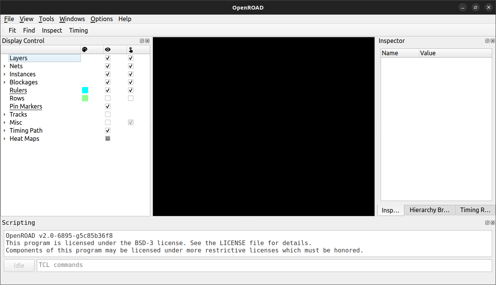

<h1 style="text-align: center;">OpenROAD installation tutorial </h1>

---

## Contents
- [Installation steps for Ubuntu](#installation-steps-for-ubuntu)
    - [Initial requirements](#initial-requirements)
        - [Installing requirements and his dependencies on Ubuntu.](#installing-requirements-and-his-dependencies-on-ubuntu)
          - [Installing CMake](#installing-cmake)
          - [Installing Docker](#installing-docker)
    - [Get the tools](#get-the-tools)
        - [Build from sources locally](#build-from-sources-locally)
    - [Verifying the installation](#verifying-the-installation)
    - [Running a design example](#running-a-design-example)

Channels for get in touch with OpenROAD communities and official pages:

- [Project homepage and news](https://theopenroadproject.org/)

- [OpenROAD github](https://github.com/The-OpenROAD-Project) 

- [OpenROAD documentation](https://openroad.readthedocs.io/_/downloads/en/stable/pdf/)

## OpenROAD overview

OpenROAD is an IC physical design tool that takes a design from synthesized Verilog to routed layout or __RTL2GDS__ flow. It is an open-source application for semiconductor digital design, which eliminates the complex barriers of cost, risks, and uncertainty involved in the process of creating hardware and integrated circuits. OpenROAD is an open-access, rapid, and flexible application that uses an API with bindings in TCL and Python.

OpenROAD has a large community of users, including hardware designers, industry collaborations, academics, researchers, and IC design enthusiasts.

OpenROAD performs several steps for building a chip. Some of the steps for creating ICs are listed below:

- Initialization of floorplan, defines the chip sizing.

- Placing pins flow.

- Place macro cells like RAMs, embedded macros.

- Insert substrate tap cells.

- Global placement for standard cells.

- Macro placement for macro cells.

- Performs a timing analysis, like reparing max slew, max capacitance and timing violations.

- CTS (Clock Tree Synthesis).

- STA (Static Timing Analysis).

- Optimization for timing, setup and hold in timing.

- Global Routing.

- Detailed Routing.

- Parasitics extraction details and reports.

For more details please visit: [OpenROAD page]([https://theopenroadproject.org/](https://theopenroadproject.org/))

## Getting started with the tool

OpenROAD has support for different PDKs. It has been validated and tested with specific PDKs in the context of various flow controllers. OpenROAD flow scripts support several public and private PDKs.

#### Open-Source PDKs

- __GF180__: Global Foundries 180nm.

- __Sky130__: SkyWater foundry 130nm.

- __Nangate45__: 45nm.

- __ASAP7__: Arizona State Predictive PDK, 7nm, FinFET process.

#### Propietary PDKs

OpenROAD has scripts that support industry PDKs. These PDKs are platform-specific files for these kits and cannot be provided like the open-source PDKs due to NDA restrictions. Nevertheless, if you have access to these platforms and technologies, you can create the necessary platform and script files for different flows.

The next PDKs are used and tested in OpenROAD.

- __GF55__: Global Foundries 55nm.

- __GF11__: Global Foundries 12nm, FinFET process.

- __Intel22__: Intel Low-Power FinFET process, 22nm.

- __TSMC65__: Taiwan Semiconductor Manufacturing Company 65nm.

# Installation steps for Ubuntu

### Initial requirements

- C++ compiler with C++11 support.

- GNU Flex, GNU Bison and GNU Make.

- Tcl/Tk 8.6 or higher.

- Python 3.6 or higher

- Git.

- Cmake

- Docker.

- 50 GB or more of space on your disk.

##### Installing requirements and his dependencies on Ubuntu.

```shell
sudo apt-get install build-essential clang bison flex \
libreadline-dev gawk tcl-dev libffi-dev git \
graphviz xdot pkg-config python3 libboost-system-dev \
libboost-python-dev libboost-filesystem-dev libboost-all-dev \
libeigen3-dev zlib1g-dev
```

###### Installing CMake

1. Install CMake with apt install:
   
   ```shell
   sudo apt install cmake
   ```

2. Verify the package
   
   ```shell
   dpkg -L cmake
   ```

3. Check the version of CMake
   
   ```shell
   cmake --version
   ```

###### Installing Docker

Before you install Docker for the first time on a new machine or if you do not have Docker installed on your machine, you need to set up the Docker repository.

- ```shell
  sudo apt-get install docker docker-compose docker-doc docker.io docker-registry
  ```
   Enter the commands below to create the **docker** group on the system.
   
- ```shell
   sudo groupadd -f docker
   ```
   
   Type the following **usermod** command to add the active user to the **docker** group.
   
-  ```shell
   sudo usermod -aG docker $USER
   ```
   
   Apply the group changes to the current terminal session by typing:
   
-  ```shell
   newgrp docker
   ```
   
   Check if the **docker** group is in the list of user groups.
   
-  ```shell
   groups
   ```
   
   The group appears in the command output:
   
   
   
   Verify that the Docker Engine installation is successful by running the **hello-world** image:

- ```shell
   sudo docker run hello-world
  ```

   This command shows a message like this:

   

### Get the tools

You can install OpenROAD with the next commands:

##### Build from sources locally

1. Clone the git repository for OpenROAD with recursive argument:
   
   ```shell
   git clone --recursive https://github.com/The-OpenROAD-Project/OpenROAD-flow-scripts
   ```

2. Once you cloned the repository open the directory _OpenROAD-flow-scripts_:
   
   ```shell
   cd OpenROAD-flow-scripts
   ```

3. Inside the directory, there is a .sh file called **build_openroad.sh**. Open it with sudo and change the text on line 34. The variable _DOCKER_OS_NAME="centos7"_ should be changed to the corresponding version of your operating system, for example, if you have Ubuntu 20.04, you must change the variable to _DOCKER_OS_NAME="ubuntu20.04"_. 
   
   - centos7
   
   - ubuntu20.04
   
   - ubuntu22.04
   
   

4. Open the directory etc/. Inside this directory there exists a file called *DependencyInstaller.sh* use the next command for install all necessary dependencies for install OpenROAD:
   
   ```shell
   sudo ./DependencyInstaller.sh
   ```

5. Return to OpenROAD-flow-scripts, and access to the next directory:
   
   ```shell
   cd ../tools/OpenROAD/etc
   sudo ./DependencyInstaller.sh
   ```

6. Return to OpenROAD root directory and execute the .sh file called build_openroad.sh
   
   ```shell
   cd ../../../
   sudo ./build_openroad.sh --local
   ```
   
   The installation of OpenROAD process is about from 30 minutes or 1:30 hours, depending on your computer capacity.
   
### Verifying the installation
   
For verifying the installation of OpenROAD Sourcing the OpenROAD env variables, and access to yosys and OpenROAD with the next commands

   
   ```shell
   source setup_env.sh
   yosys -help
   openroad -help
   exit
   ```

### Running a design example

Inside the OpenROAD-flow-scripts directory, there is a directory called **flow/**. Change the directory to **flow/** and execute the following command.

```shell
make
```

This command run a basic flow for validate the tool setup.

Once the flow finished, open the gui of OpenROAD with the next command

```shell
openroad -gui
```

The commands open a gui like this:



Select the **File** window at the top of the GUI and choose **Open DB**. Once the file explorer is open, go to /flow/results/nangate45/gcd/base and open the file named **final.odb**. You will be able to view a schematic like this:

